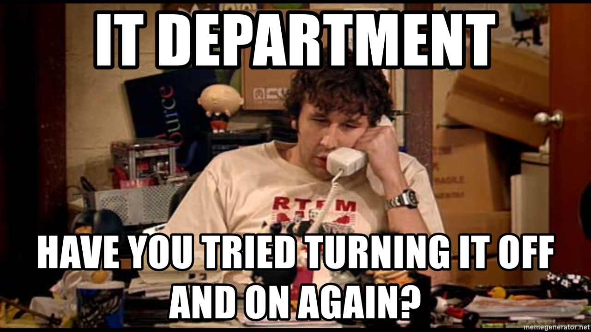

# traps

- Have you tried turning it off and on again?
  - [Cannot type in Korean](turn-it-off-and-on/cannot_type_korean.md)
- errors
  - [/usr/bin/ld: cannot find -lstdc++](errors/cannot_find_-lstdc++.md): No such file or directory

